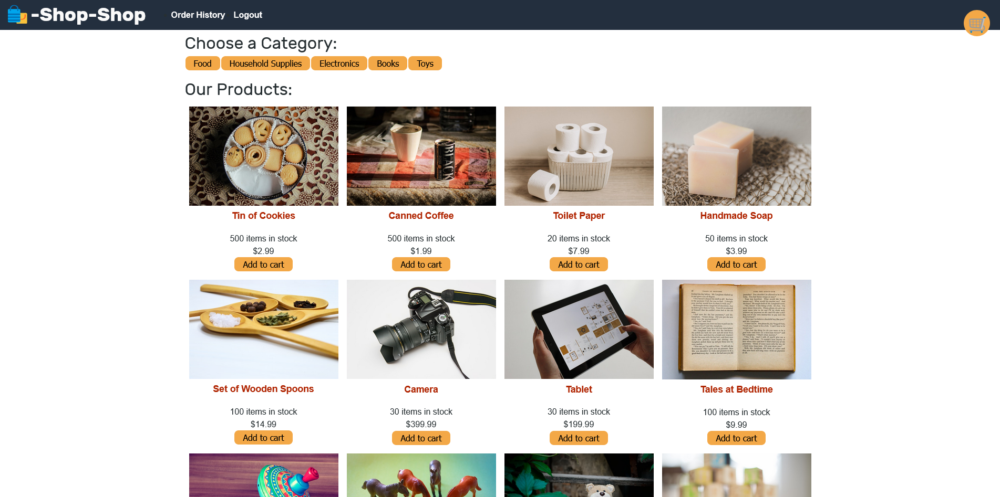

# Shop Shop



# Description
A simple e-commerce website with user authentication and checkout. Utilizes a global Redux store that included data such as the categories, products, and data on the cart. Updated from a context API store. The Redux store was built using ```configureStore``` as well as ```createSlice``` for the slices from the ```@reduxjs/toolkit``` library. The info was retrieved in the front-end using ```useSelector``` and updated using ```useDispatch``` from the ```react-redux``` library.

# Links
[Deployed Page](https://aqueous-dawn-77830.herokuapp.com/)